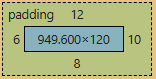
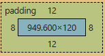
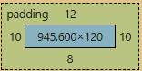

# Box model

## display 

### 2 types of default boxes

- block
  - take the whole line
  - line return after and before the box

- inline
  - as wide as its content
  - doesn't force line break
  - can't change size
  - ignore margin top-bottom
  - **DO NOT MODIFY SIZE / PADDING / MARGIN OF INLINE BOXES**

### compromise for sized inline

```inline-block```   
Allow for proper resizing, padding and marging  
Acts as an inline if not size, padding nor margin is specified
Does not take the whole line nor line break like a ```block``` box

### box-sizing

The size of any element include :  
content, padding, border  

but not margin

using 
```css
p {
  box-sizing: border-box;
  width: 200px;
  padding: 30px;
  border: 2px solid blue;
}
```
will limit the final size of the box to the width, meaning width will no longer be the width of the content but of the whole element (content+padding+border)

## box layers

- content  
- padding  
spacing between content and limit of the box
- border  
box limit
- margin  
spacing between that box limit and other ones'

## shorthand

### padding / margin

we can set different padding / margin / ... in the same instruction, the order being top, right, bottom, left
for example
```css
p {
  padding: 12px 10px 8px 6px;
}
```
  

or top-bottom / left-right
```css
p {
  padding: 12px 8px;
}
```
  
or top / left-right / bottom
```css
p {
  padding: 12px, 10px, 8px
}
```
  

### border

border can be shorthanded in that order :  
border-width / border-style / border-color
```css
p {
  border-width: 2px;
  border-style: solid;
  border-color: blue;
}
```
```css
p {
  border: 2px solid blue;
}
```

## generic boxes

### div

generic box, must be used only for visual modifications  
Should always prefer section / article tags if possible  

no style by default  
block by default

### span

generic inline box

## reset css

```css
* {
  margin: 0;
  padding: 0;
  box-sizing: border-box;
}
```
in css \* is a universal selector applying its rule to every tag, must use that snippet as the FIRST rule of the css file